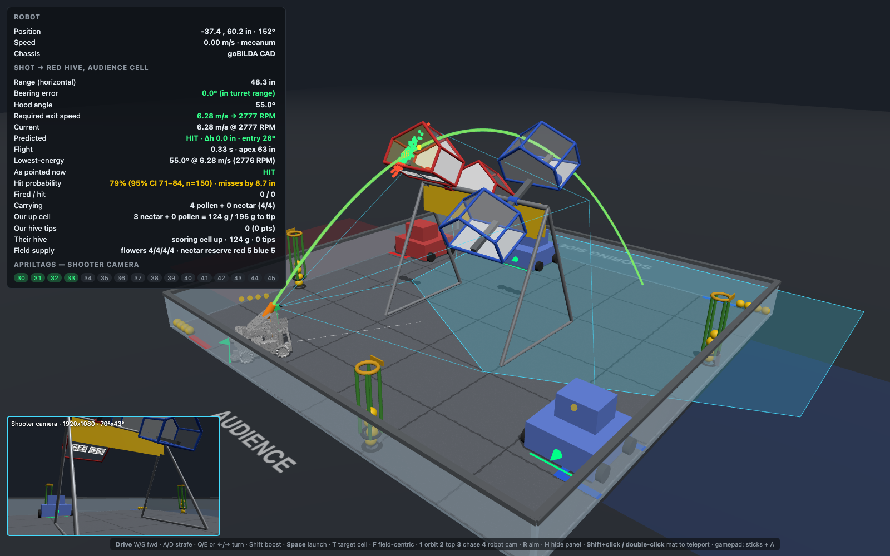
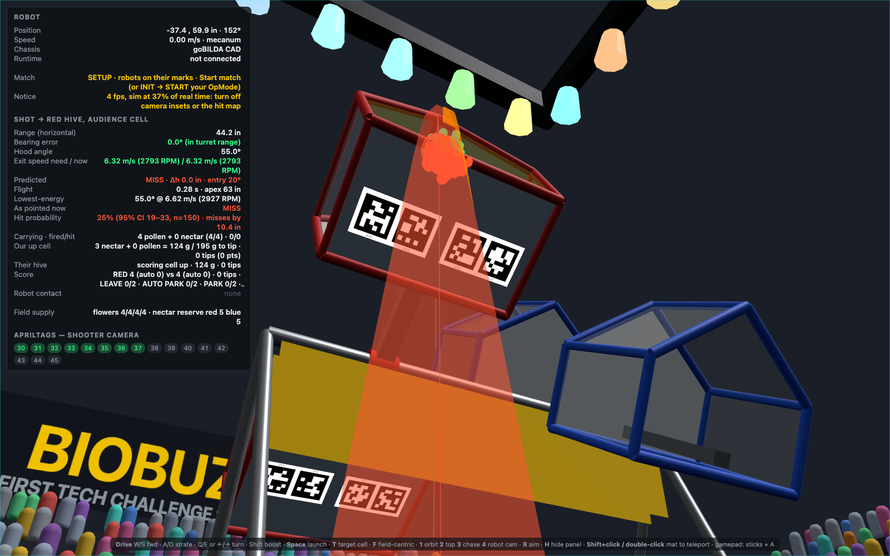
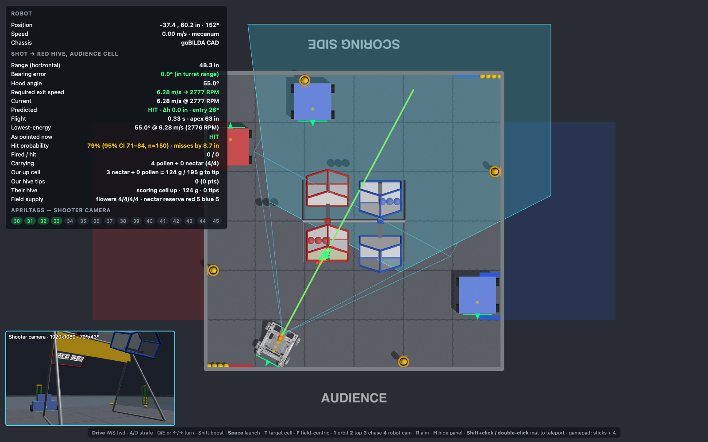
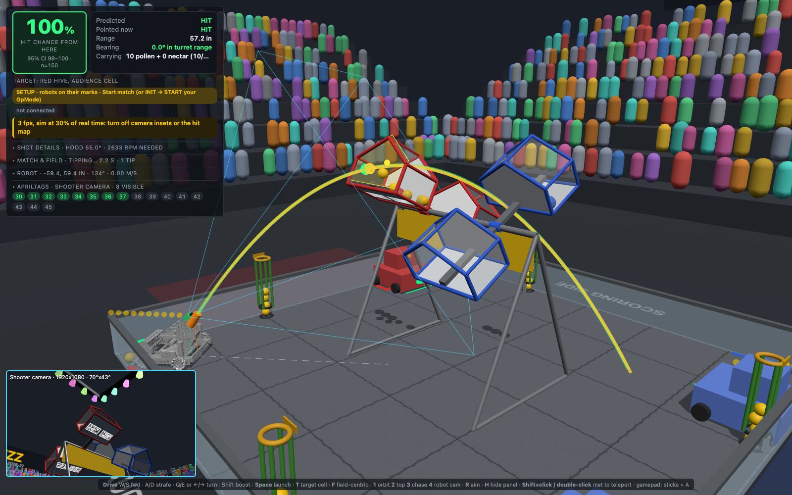
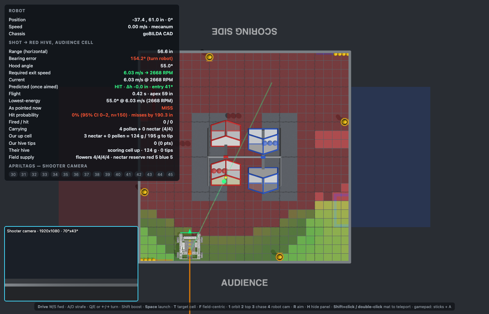
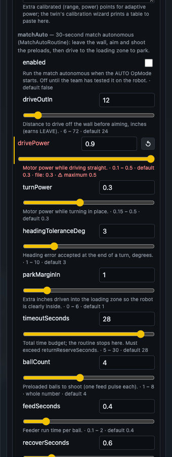
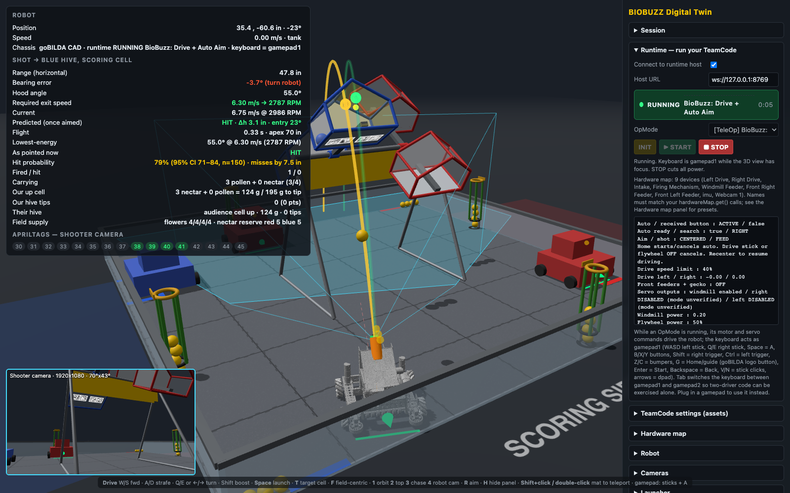
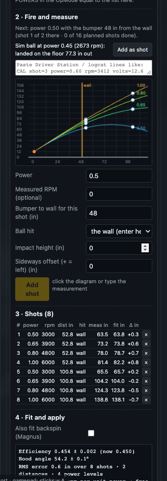

# BIOBUZZ Digital Twin

A browser-based 3D digital twin of the FIRST Tech Challenge 2026-27 **BIOBUZZ** field and of our robot.
Use it to:

- see exactly what the robot's cameras see from any spot on the mat (field of view footprint, frustum, which AprilTags are in frame, which are occluded by the hive or other robots);
- read off the hood angle, exit speed, flywheel RPM and arc needed to launch POLLEN or NECTAR into the upward-facing CELL from wherever the robot is standing;
- drive around (mecanum or tank, keyboard or gamepad) with simulated partner and opponent robots moving as obstacles;
- load the goBILDA StarterBot CAD (6WD or Strafer mecanum) as the chassis and tune the launcher.

Field geometry comes from the Competition Manual (TU02, Section 9) and the Event Field Setup Guide v1.0.
See `docs/superpowers/specs/2026-10-04-biobuzz-digital-twin-design.md` for the numbers used and the design.

**Try it in the browser:** the twin is a static web app, published to GitHub Pages from `main` at
<https://camels-hump-coders.github.io/biobuzz-digital-twin/> (see [Hosting](#hosting-github-pages)). Driving, cameras, launcher
analysis and the match simulation all run in the page; only running your Java TeamCode needs the local host below.

## Set up

You need Node 22, pnpm 12 and, only for the virtual runtime, a JDK (17 or newer). The repo carries a [flox](https://flox.dev) environment that provides all of them (plus Gradle and Python 3), so the quickest path is:

```bash
git clone git@github.com:camels-hump-coders/biobuzz-digital-twin.git
cd biobuzz-digital-twin
flox activate          # drops you into a shell with node, pnpm, java and gradle on PATH
pnpm install
```

Without flox, install Node 22 and pnpm yourself (`corepack enable && corepack prepare pnpm@latest --activate`), and point `JAVA_HOME` at a JDK 17+ if you want to run TeamCode (Android Studio's bundled JDK is picked up automatically when `JAVA_HOME` is unset).

## Run the twin

```bash
pnpm dev          # http://localhost:5173
pnpm test         # unit tests for geometry, ballistics, kinematics, camera math
pnpm build        # static site in dist/ (also deployed to GitHub Pages, see Hosting)
```

The side panel on the right holds the settings. It opens in **Essential** mode, showing the everyday controls (preset, drivetrain, intake side, launcher RPM and hood, alliance and target, other robots, main view and mat maps); each section has a *Show N more settings* button for the rest, and **All settings** at the top shows everything. The HUD on the left reads out the shot analysis. Press **H** to hide the panel, **1**–**4** to switch views, and see [Controls](#controls) for driving. Your settings persist in the browser; export them from the **Session** section to share.

## Gallery

| | |
|---|---|
|  |  |
| **Shot analysis.** Hood angle, exit speed and flywheel RPM to reach the raised CELL from where the robot stands, the Monte-Carlo dispersion cloud and the hit probability; partner and opponents on the field. | **Robot camera.** Press 4 to see exactly what the configured webcam sees (preset lens, mount position, pitch); the HUD lists which AprilTags are in frame and which are occluded. |
|  |  |
| **Top view.** Camera ground footprint, FOV frustum, the launch line and the start/loading zones; shift-click anywhere to teleport and auto-aim. | **Hive physics.** Balls fly, bounce and settle in the cell; the hive tips at the calibrated load and pours the pieces out as it swings. |
|  |  |
| **Hit-probability map.** From every 6 in square, aim and fire 40 simulated shots with your shot variability: green always scores, red never; dimmed where the selected camera cannot see the target cell's AprilTags. Watch it change as you tweak hood angle, RPM limits, variability or camera mounts. | **TeamCode settings.** The OpModes' JSON assets as a searchable form; edits are simulator-only overrides merged at INIT, the repo files stay untouched. |
|  |  |
| **Virtual runtime.** The team's unmodified Java OpMode (here: tag-based auto aim) running on a desktop JVM, driving the simulated robot from the browser with INIT / START / STOP and live telemetry. | |

## Run your TeamCode against the twin (virtual runtime)

Coders can test OpModes without touching the robot. `runtime/` is a desktop JVM host with an FTC SDK shim: your unmodified Java OpModes compile against it and run with INIT / START / STOP from the browser, reading encoders, IMU, AprilTag detections and gamepads from the sim and driving the simulated robot with their motor and servo commands.

Your code stays in your Android Studio project; nothing is copied or moved. One command builds it against the shim, starts the host, starts the twin and opens the browser already connected:

```bash
pnpm sim --team ~/dev/FtcRobotController     # project root, TeamCode module, or its java folder all work
pnpm sim                                      # later runs reuse the remembered path
```

Then pick an OpMode in the **Runtime** panel → INIT → START. Edit your Java in Android Studio and save: the host recompiles and restarts within a few seconds and the browser reconnects, so you never leave the twin. Options: `--exclude "**/roadrunner/**,**/Old*.java"` to skip files that use SDK classes the shim lacks, `--no-watch`, `--no-browser`, `--port`, `--host-port`. The JDK is taken from `JAVA_HOME`, or Android Studio's bundled one if that is missing.

The host also runs the **real FTC Panels dashboard** (com.bylazar, the same library your code uses on the robot): open http://localhost:8001 from the *Open Panels dashboard* link in the Runtime panel. Telemetry, graphs, field drawings, configurables and OpMode control all come from your code's own Panels calls, fed by the simulated robot, so what Panels shows for the twin is what it would show for the robot. There is no camera video: the twin does not stream pixels (see *Known simplifications*), so a camera-stream widget stays blank.

See `runtime/README.md` for the hardware-map setup, keyboard-as-gamepad bindings, what the shim covers and the wire protocol. Three sample OpModes ship with it: a mecanum TeleOp, an AprilTag auto-aim autonomous and the shooter-calibration OpMode (see *Launcher model*).

## Test bed for coding agents (and CI)

`pnpm twin-test` runs one OpMode headlessly against the twin from a scenario file, injects gamepad inputs at simulated times, checks expectations and writes a JSON report with telemetry, pose, shots and errors:

```bash
pnpm exec playwright install chromium                      # once
pnpm twin-test --team ~/dev/FtcRobotController --scenario scenarios/example-teleop.json
```

Scenarios (`scenarios/scenario.schema.json`) choose the OpMode, alliance, robot and hardware presets, asset overrides, start pose, inputs and `expect` checks (`noErrors`, `shotsFired ">=1"`, `telemetryIncludes`, `movedAtLeastIn`, …). It uses ports 5190/8790 so a running `pnpm sim` is not disturbed.

**Agent skill.** `skills/biobuzz-twin/SKILL.md` teaches a coding agent (Claude Code, Codex, Cursor and the other agents the [skills](https://skills.sh) CLI supports) to find the twin, check it is installed, run the team's code through it and read the report. Two ways to install it into a team repo:

```bash
# 1. straight from this GitHub repo with the skills CLI (run inside the team repo)
npx skills add camels-hump-coders/biobuzz-digital-twin --skill biobuzz-twin            # prompts for the agents to install to
npx skills add camels-hump-coders/biobuzz-digital-twin --skill biobuzz-twin -a claude-code -y   # no prompts
npx skills add camels-hump-coders/biobuzz-digital-twin --skill biobuzz-twin -g         # user-wide instead of this project
npx skills update                                                                       # later, pull the newest version

# 2. from a local checkout of this repo
pnpm skill:install ~/dev/FtcRobotController     # copies to <team>/.claude/skills/biobuzz-twin and writes .biobuzz-twin.json
```

`npx skills add ... --list` shows what the repo offers. The CLI install does not know where your twin checkout is; the skill then looks for a sibling `biobuzz-digital-twin` directory or clones one, so optionally add `.biobuzz-twin.json` (`{ "twinPath": "/path/to/twin" }`) to the team repo root to point it somewhere else. Commit the skill files; from then on "run this through the twin" is something every teammate's agent knows how to do.

## Agent API: let a coding agent look at (and steer) your live session

While `pnpm sim` runs, the host serves a small local HTTP API next to its WebSocket port (default http://127.0.0.1:8766/, shown in the Runtime panel; `GET /` lists everything). A coding agent on the same machine can debug what you are seeing without screenshots or copy-pasting:

```bash
curl -s http://127.0.0.1:8766/api/status                      # runtime status, OpMode, error, OpMode list
curl -s http://127.0.0.1:8766/api/snapshot?seconds=30         # the Timeline panel's Markdown snapshot
curl -s http://127.0.0.1:8766/api/state                       # pose, match, score, inventory, hives, telemetry
curl -s http://127.0.0.1:8766/api/telemetry ; curl -s 'http://127.0.0.1:8766/api/log?tail=200'
curl -s -X POST http://127.0.0.1:8766/api/overrides -d '{"biobuzz/robot-profile.json": {"matchAuto.startPosition": "FAR_SIDE"}}'
curl -s -X POST http://127.0.0.1:8766/api/twin -d '{"alliance": "red", "robot.launcher.elevationDeg": 52}'
curl -s -X POST http://127.0.0.1:8766/api/match -d '{"action": "init", "opMode": "BioBuzz: Drive + Auto Aim"}'   # then start / stop / reset
curl -s -X POST http://127.0.0.1:8766/api/gamepad -d '{"pad": 1, "values": {"a": true}, "holdMs": 300}'
```

Settings an agent applies show up in the panel immediately (and in the timeline as a note), exactly as if you had typed them, and are sent to TeamCode at the next INIT. If the agent cannot reach your machine, it can instead print the settings as `"key": value` lines; paste those into the **Paste settings from an agent** box in the TeamCode settings panel, which picks the right file and applies them. Localhost only, no authentication: anything on your machine can drive the session.

## Timeline & logs: go back in time, hand a moment to an agent

Telemetry changes faster than anyone can read, so the twin records the last ~10 minutes at 10 Hz: telemetry, runtime status, pose, match state, held gamepad buttons and sticks, shots, score, the other robots, every ball and the hive tilts, plus events (status changes, Home/button presses, shots, host console lines from your OpMode and `RobotLog`, exceptions with their stack traces, fouls). The **Timeline & logs** section has a slider that **replays the run on the field**: drag it back and the robots, balls and hives move to that moment, the telemetry box shows what the OpMode printed then (marked ⏪) and the HUD's Match row says REPLAY; the live simulation pauses while you look and resumes when you press *Live*. Step buttons move 0.1 s or 1 s at a time, *Play* replays at real speed, *Run start* jumps to the latest INIT, and the slider covers the latest INIT→STOP run by default (*Everything* widens it to the whole recording). Click an event to jump to it. This works standalone (no host needed); in server mode every finished run is also saved under `runtime/runs/` and agents can scrub your view or fetch any moment through the agent API (`/api/run`, `/api/replay`, `/api/runs`). **Copy last 30 s / 2 min** puts a Markdown snapshot on the clipboard: context (OpMode, presets, hardware map, asset overrides and bound values, camera mounts, start positions), the event list, and the telemetry at every change in the window. Paste it to a teammate or an agent. *Download full log* saves everything as JSON.

## TeamCode settings with help, dropdowns, sliders and validation

The TeamCode settings panel edits your JSON assets as overrides, but a bare JSON value does not say what it means, what range is sane or which enum strings the code accepts. Put a **JSON Schema sidecar** next to each asset (`robot-profile.schema.json` beside `robot-profile.json`, shipped by the host like any asset) and every setting gets a description under its row, enums become dropdowns, `minimum`/`maximum` become a slider with an exact box, integers snap, defaults are shown, and anything outside the schema is flagged red with the reason (the file badge counts invalid values). The filter searches names, descriptions and enum values, so "start square" finds `matchAuto.startPosition`. Agents get the same through `GET /api/schema`, and the skill asks them to update the schema whenever they add or change a setting in the Java that parses it. The Camels Hump repo now carries schemas for both profile files, seeded from the ranges and enums its parsers enforce.

## Twin bindings: one source of truth for robot measurements

Your OpModes carry settings that describe the physical robot (wheel diameter, ticks per revolution, track width, camera mount, alliance, shooter direction). The twin models the same facts. `TeamCode/twin-bindings.json` in the team repo says which asset key is derived from which twin knob; the twin evaluates it whenever a knob changes and feeds the results to your code at INIT as asset overrides, marked ⇐ in the TeamCode settings panel. Measure once, in the twin, and the sim and your code can never disagree.

```json
{ "version": 1, "bindings": [
  { "asset": "biobuzz/robot-profile.json", "key": "wheelDiameterIn", "twin": "robot.wheelDiameterIn", "round": 3 },
  { "asset": "biobuzz/robot-profile.json", "key": "camera.pitchDeg", "twin": "hardware.webcam_1.pitchUpDeg" },
  { "asset": "biobuzz/robot-profile.json", "key": "tagTracking.alliance", "twin": "upper(alliance)" } ] }
```

Expressions use knob names, numbers, `+ - * / ( )` and `round abs min max upper lower`; `map` translates values and `round` rounds. *Download twin knob catalogue* in the panel lists every knob with its current value: `robot.*` (dimensions, wheels, mass, drivetrain), `camera.<name>.*` and `hardware.<webcam name>.*` (mount in inches, pitch both signs, yaw, roll, FOV), `launcher.*`, `hardware.<device>.*` (port, ticks, free RPM, direction sign), `start.*`, `alliance`, `hive.*`. The committed asset files are still what runs on the robot. When you like the values (overrides you typed, bound values from the twin, calibration results), press **Export** in the TeamCode settings panel: it downloads each changed file with the values written in, keeping the file's key order and indentation so the commit diff shows only what changed. Drop them into `TeamCode/src/main/assets/<path>` and commit.

## Match flow

The field loads in **setup**: every robot parked on its starting mark (Field & target → *Starting positions*, mirrored when you play blue; by default you start on the half of the field our hive's raised cell faces and the partner on the other), pieces at match start, the other robots idle. **Start match** releases the 2:30 clock and the scripted robots; **Stop** freezes them; **Reset to start** parks everything again and puts the field back exactly as the rules set it up: red hive audience cell up, blue hive scoring cell up, 3 NECTAR staged in each raised cell, flowers and gardens full, 4 POLLEN preloaded (the T key and the hive selectors are for practising other states and are overridden by a reset). With TeamCode connected the Driver-Station buttons do the same for the whole field: INIT resets the board, START starts your OpMode and the match together, STOP ends both.

**Scoring** follows Competition Manual §10.5, Table 10-2, and shows in the HUD's *Score* row and in timeline snapshots: HIVE TIP 20 (tips completed in the first 30 s count as AUTO), LEAVE 3 per robot no longer touching the perimeter wall at the end of AUTO, AUTO PARK 5 per robot at least partially in its alliance's LOADING ZONE at the end of AUTO, TELEOP PARK 5 at the end of the match, 2 per POLLEN/NECTAR left in an upward cell, 1 per ball in the GARDEN. The row also tells you your own robot's LEAVE / PARK status live, so you can check an autonomous routine earns what you expect; LEAVE and AUTO PARK are latched when the clock passes 0:30 of AUTO (2:00 left), PARK when the match ends. Both LOADING ZONES are taped on the mat (23 in by 11 in, in the corner next to each alliance area). The scripted robots drive to their LOADING ZONE in the last 12 seconds. FLOWER points are not modelled.

## Saving, sharing and resetting

Everything in the side panel is kept in the browser's localStorage. The **Session** section at the top of the panel has:

- *Export robot config* / *Import robot config*: a JSON file with the robot preset, dimensions, cameras, launcher, shot variability, hardware map and game-piece settings. Share it across browsers or commit it next to your TeamCode.
- *Export whole session* / *Import whole session*: everything, including pose, view and overlay toggles.
- *Reset session to defaults*: clears the saved state and reloads, keeping your TeamCode asset overrides unless you tick the box beneath it. *Reset robot to preset* only puts the robot back to its preset.

## Controls

| Key | Action |
|---|---|
| W / S | drive forward / back |
| A / D | strafe (mecanum only) |
| Q / E or ← / → | rotate |
| Shift | boost to full speed |
| Space | launch a ball with the current hood angle and RPM |
| T | flip which cell of our hive is up (resets that hive) |
| R | rotate the robot so the launcher points at the target |
| F | toggle field-centric driving |
| 1 / 2 / 3 / 4 | orbit / top-down / chase / robot-camera view |
| H | hide the side panel |
| Shift+click or double-click on the mat | teleport the robot there and aim at the target cell |

Gamepad: left stick drive, right stick rotate, A launch, B aim at target, Y flip target, X field-centric, right trigger boost.

## Mat overlays

Two field-wide maps live in **View & overlays**:

- **Reachability map**: the flywheel RPM needed to hit the target cell from each 6 in square (green low, red near the maximum, dark unreachable).
- **Hit-probability map**: from each square, aim at the target, take the hood/RPM the launcher would need from there and fire 40 simulated shots with the configured shot variability; the square is coloured by the fraction that land in the cell. Squares are dimmed where the selected camera would not see any of the target cell's AprilTags, since auto-aim could not lock on from there. The map fills in over a few seconds and recomputes as you change the launcher, variability, hood angle, cameras or target, so you can watch a camera FOV or mount change open up or close off parts of the field.

**Performance stats** (same section) shows how long each part of the frame takes.

## What the HUD tells you

- **Range** and **bearing error** from the launcher exit point to the aim point (centre of the up-cell opening, 2 in inside).
- **Required exit speed / RPM** for the current hood angle. With *Auto-RPM* on, the commanded RPM tracks this as you drive.
- **Two arcs**: green/red is the arc *if the robot were aimed* at the target with the current hood angle and RPM; orange is the arc along the direction the launcher *actually points right now*. They coincide once you press R or turn to face the target. Either can be switched off in View & overlays.
- **Shot variability**: every fired ball draws random exit speed, elevation, yaw and spin errors (1-sigma values in the Launcher panel, defaults 3 %, 1°, 1°, 20 %). The HUD **hit probability** re-simulates 150 perturbed shots from the current pose and shows the hit fraction with a 95 % confidence interval and the mean miss distance; the dot cloud on the opening plane shows where each lands (green hit, red miss).
- **Match pieces.** The field starts as at competition: 4 POLLEN preloaded on the robot, 4 in each FLOWER, 4 in each GARDEN, 3 NECTAR in each raised cell, 5 NECTAR per alliance in reserve. You can only launch what you carry (capacity 4 by default, POLLEN/NECTAR handling configurable in the Field panel). Balls enter only through the intake side (Robot panel: front/rear/left/right and mouth width; the bar on the floor outline marks it: green while the intake runs, red while it is off). Drive that side into a loose ball, or up to a FLOWER's retrieval opening, to pick up; under TeamCode the intake motor must be powered. Any other side of the chassis pushes balls out of the way, and so does the intake once you carry the maximum. After every tip one reserve NECTAR appears in that alliance's LOADING ZONE. The HUD shows what you carry, FLOWER stocks and the NECTAR reserve; the small translucent dots above a robot are the same count, not loose balls. *Reset match to start* puts everything back.
- **Other robots score.** With *They collect and score* on, the partner (your alliance) and the two opponents (the other alliance) run a loop: collect from FLOWERS or loose balls, drive to a launch spot in front of their raised cell, aim, fire with a noisy but calibrated shot, repeat. Each shoots only at its own alliance's hive and only picks up its own colour of NECTAR; switching *Our alliance* flips which robots are partner and opponents and mirrors their starting corners. Both hives count loads and tip, so ball availability and the cell you are aiming at change under you. They are also obstacles and occluders.
- **Hive tipping.** Balls that come to rest in the up cell count toward its load, shown in the HUD with the 3 NECTAR field staff stage there. Field staff calibrate cells to tip at 8 POLLEN or 3 NECTAR + 3 POLLEN, 198.6 g, so with the default 195 g threshold three POLLEN in tips it. The hive then swings over, faster the heavier the load (about 2.6 s at the threshold, under 1 s when well over), the balls ride the swinging cell and roll out as its floor steepens, and the other cell comes up facing the other side of the field, so you have to reposition to keep scoring. Tips and points are tallied in the HUD. Pressing T or choosing a cell in the Field panel resets the hive to match start. The threshold and the auto-tip toggle live in the Field panel.
- **Predicted HIT / MISS** for the current hood angle and RPM, with the height error at the target and the entry angle into the opening plane. The arc is drawn green (hit) or red (miss). If the launcher is not pointed at the target the arc shows what would happen once aimed.
- **Lowest-energy** solution across the hood's adjustable range, plus a fan of all feasible arcs. *Auto-hood* sets the hood to it.
- **Reachability map** (View & overlays): colours every 6 in square of the mat by the RPM needed to hit the target from there with the current launcher. Green is comfortable, red is near the motor limit, dark red cannot reach. Use it to pick launch spots and to see what a fixed hood angle costs you.
- **AprilTags**: green = in frame, facing the camera and unoccluded; orange = in frame but blocked; hover for distance and apparent size in pixels.

## Cameras

**Placing cameras**: in orbit view drag a camera's green body across the robot to move it; hold Alt while dragging to raise or lower it. Use the *+ Rear camera*, *+ Left*, *+ Right* buttons for quick extra mounts (rear is yaw 180°, 7 in behind centre), then fine-tune the numbers. The inset always shows the selected camera, so a rear camera's view is one click away.

*Flip forward direction (180°)* in the Robot panel makes the other end of the robot the forward arrow, moving the CAD, cameras and launcher with it, for teams that treat the shooter side as forward.

Pre-seeded FTC-legal UVC webcams with their published fields of view (Logitech C270/C920/C930e/Brio, Microsoft LifeCam HD-3000, Arducam OV9281/OV9782 global shutter lenses, Limelight 3A). Add as many mounts as you like; each has height, forward/left offset, pitch, yaw, roll and a FOV/resolution override. Every enabled camera gets its own inset in the bottom-left (click an inset to select that camera); press 4 to put the selected one full screen. FTC allows at most two cameras on a robot, so the add buttons stop at two.

## Launcher model

Exit speed = *efficiency* x flywheel surface speed. Hooded single-wheel shooters measure roughly 0.30-0.45; dual opposing wheels around 0.85-0.9. Flight uses quadratic drag (Cd 0.45) and optional Magnus lift from backspin. Use the calibration wizard below to measure efficiency and hood angle on your robot instead of guessing.

### Calibrate the twin against your robot (Launcher ▸ Shooter calibration)

The twin only predicts shots as well as its launcher numbers, so there is a guided way to measure them on the real robot:

1. Copy `runtime/samples/.../TwinCalibration.java` into your TeamCode (edit the hardware names at the top if yours differ; it already knows the StarterBot and Camels Hump names). It runs unchanged on the robot and in the twin.
2. Park the robot square to a wall with the shooter facing it and measure the bumper-to-wall distance and the ball exit height; type both into the wizard. The wizard proposes a plan: a few flywheel powers at two distances, two shots each (edit the lists to taste; keep `POWERS` in the OpMode equal to the wizard's list).
3. Run the OpMode: dpad steps the power, X spins the flywheel, A fires one ball. Each shot is announced as `CAL shot=N power=P rpm=R volts=V` on telemetry and in the log. Note where the ball hit: the height on the wall, or how far out it landed if it came down first (a tape on the floor is the easy measurement; high-power shots at 55° reach a wall 10 ft up).
4. Enter each shot in the wizard: paste the `CAL` lines (they arrive by themselves when the OpMode runs in the twin), click the side-view diagram where the ball hit, *Add shot*. The fitter runs after every shot and reports efficiency, hood angle and backspin with uncertainties, the RMS error, and what measurement would help next (the hood angle only separates from exit speed when the geometry varies: two distances, or a wall hit plus a floor landing).
5. *Apply to twin* writes the fitted values into the Launcher (and the flywheel's free speed into the Hardware map when the OpMode reported RPM). The wizard also prints the values TeamCode's range → power model wants (`launchAngleDeg`, `exitHeightIn`, a `powerTable`) and can send the scalar ones to the TeamCode settings overrides.

The session (setup and shots) is saved with the rest of the state and can be exported/imported as JSON. To try the wizard without a robot, run the calibration OpMode in the twin: the sim's own shots show up as *Sim ball* rows you can add as measurements (the perimeter counts as an infinitely tall wall for this), and the fit should land on the Launcher values you started with.

Presets: goBILDA StarterBot (single 96 mm Hogback flywheel on a 6000 RPM 5203 motor, fixed 55° hood, fires out the **back** over the ramp so *Launcher yaw* is 180°), dual flywheel with adjustable hood, custom. The orange exit marker on the robot can be dragged like a camera (Alt-drag for height) and is hidden from the camera views.

## goBILDA CAD

The StarterBot assemblies are published by goBILDA as STEP (about 420 MB each):

- 6WD: https://www.gobilda.com/content/step_files/3200-2627-0003.zip
- Strafer mecanum: https://www.gobilda.com/content/step_files/3200-2627-0004.zip

`scripts/step2glb.py` converts a STEP file to a web-sized GLB (drops parts under 10 mm, tessellates at 0.4 mm):

```bash
python3 -m venv .venv && .venv/bin/pip install cadquery trimesh numpy
.venv/bin/python scripts/step2glb.py 3200-2627-0004.step public/models/starterbot-mecanum.glb
.venv/bin/python scripts/step2glb.py 3200-2627-0003.step public/models/starterbot-6wd.glb
scripts/optimize-glb.sh starterbot-mecanum.glb public/models/starterbot-mecanum.glb   # 185 MB, 8 M triangles -> ~0.6 MB
```

The raw tessellation is about 185 MB with 8 million triangles; the optimise step welds, simplifies to about 320 k triangles and Draco-compresses it to roughly 600 KB, which is what is committed in `public/models/`. Use the *CAD yaw* field in the Robot panel if the model's front does not match the robot's forward arrow.

If a GLB is missing the app falls back to a procedural box with the same footprint and says so in the HUD.

## Hosting (GitHub Pages)

The browser part needs no server: `pnpm build` produces a static site in `dist/`, and `.github/workflows/pages.yml` builds and deploys it to GitHub Pages on every push to `main` (one-time setup: repository **Settings → Pages → Source: GitHub Actions**). `BASE_PATH` sets the sub-path the site is served from, so the same build works at `https://<org>.github.io/<repo>/` or at a root domain.

What works on the hosted page: everything except running Java TeamCode. The virtual runtime needs the JVM host on your own machine; start it with `pnpm sim --team <path>` and the hosted page can still connect to it, because browsers treat `ws://127.0.0.1` as a trusted origin even from an https page (Chrome and Firefox do; Safari may block it, in which case use the local dev server that `pnpm sim` opens).

## Known simplifications

- The *predicted* HIT/MISS and the hit probability are geometric: the arc must cross the opening plane inside the pentagon (shrunk by the ball radius plus the 12 mm lip tube) while moving into the cell. *Fired* balls are simulated live with drag, gravity and bounces off the hive cells, frame, flowers, walls, robots and floor (restitution about 0.45, foam floor 0.5), and a shot only counts as a hit in the Fired / hit tally when the ball comes to rest inside the target cell (low-speed contacts are treated as resting, so balls settle on the sloped floor). Tipping is a timed swing driven by the load, not a rigid-body simulation of the bi-stable hive.
- AprilTags are real tag36h11 codes (IDs 30–45) at the manual's cluster geometry (centres at ±2.75 and ±6.5 in, 7.19 in behind the opening), so a vision pipeline looking at the camera inset sees genuine tags. The runtime hands detections to TeamCode synthetically: they are computed from the scene geometry (which tags are in the camera's frustum, facing it and unoccluded) and delivered through the SDK's `AprilTagProcessor` objects with the same fields the real pipeline fills. No pixels flow to your code, so processors that read the image itself, and dashboard camera streams, have nothing to show.
- Partner and opponent robots are scripted: they collect from FLOWERS and loose balls, drive to a launch spot in front of their alliance's raised cell routing around the hive legs, flowers and other robots, and score with a 55° shot. They push loose balls and bump chassis-to-chassis like the real thing, but have no defence strategy and only re-route when they get stuck for a few seconds.
- Driving: the two triangular frame legs and the four FLOWER cages block the robot; the space under the cells between the legs is open, as on the real field.
- Robot-vs-robot contact is a traction contest (0.8 x weight; set *Mass* in the Robot panel). A robot driving against a push resists with all its traction, an idle tank robot skids sideways but can be rolled lengthwise at about half, mecanum rollers give a little in every direction, and the perimeter always holds. Holding an opponent (directly or against the wall) counts a G421 PIN in the HUD: 3 s is a MAJOR FOUL and another every 3 s; scripted robots back off before the count runs out.
- Camera images are ideal pinhole renders: no lens distortion, exposure or motion blur.

## Coordinate system

Metres internally, inches in the UI. Origin at field centre on the tile surface, X toward the blue alliance, Y up, +Z toward the audience. Heading 0 means the robot faces the scoring side.
