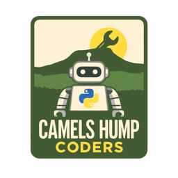
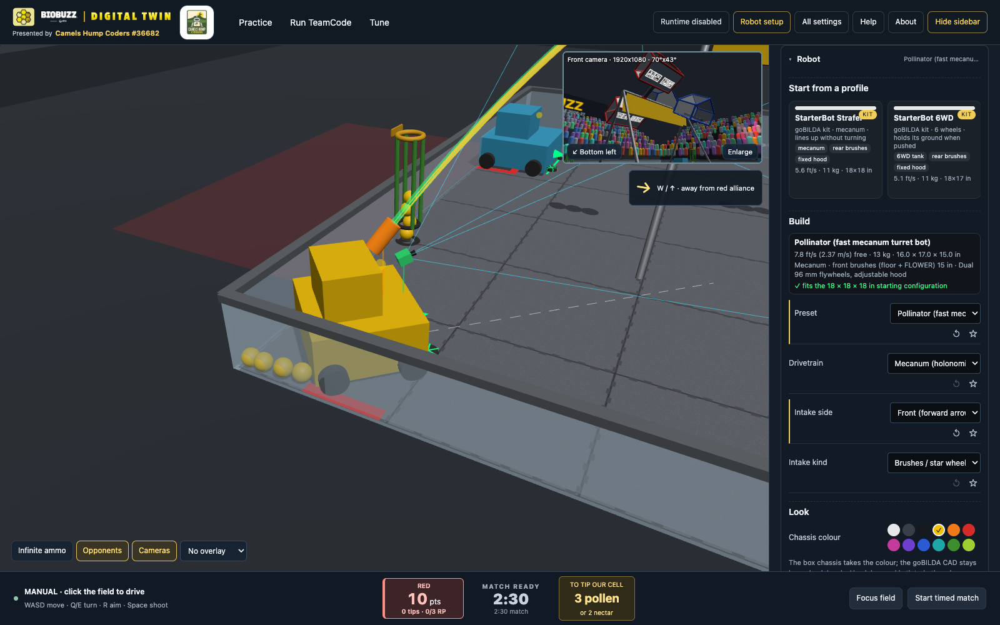
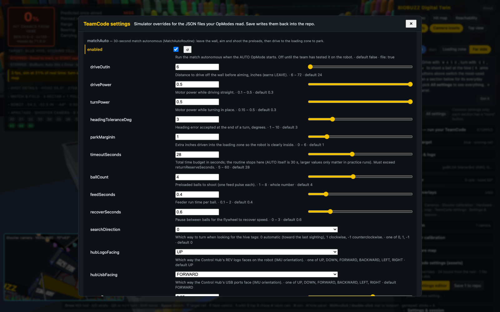
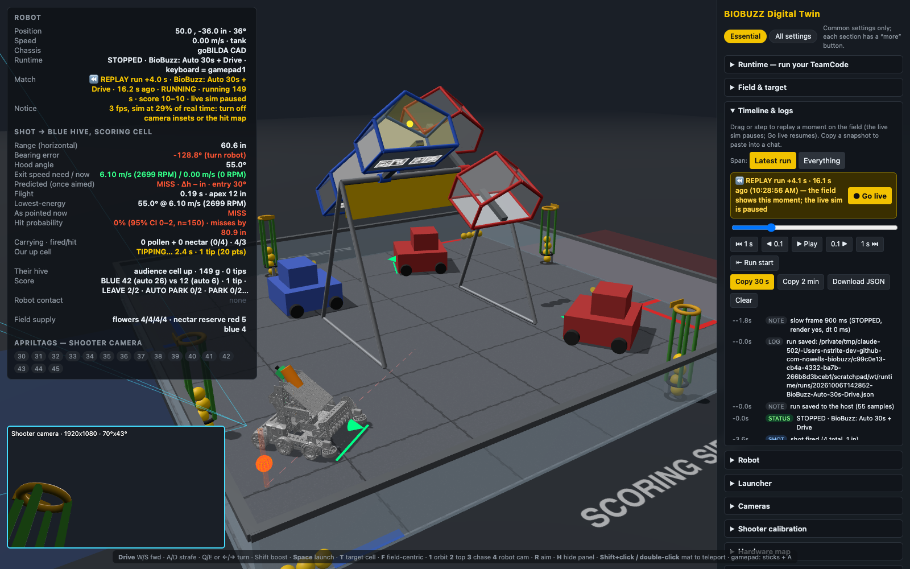
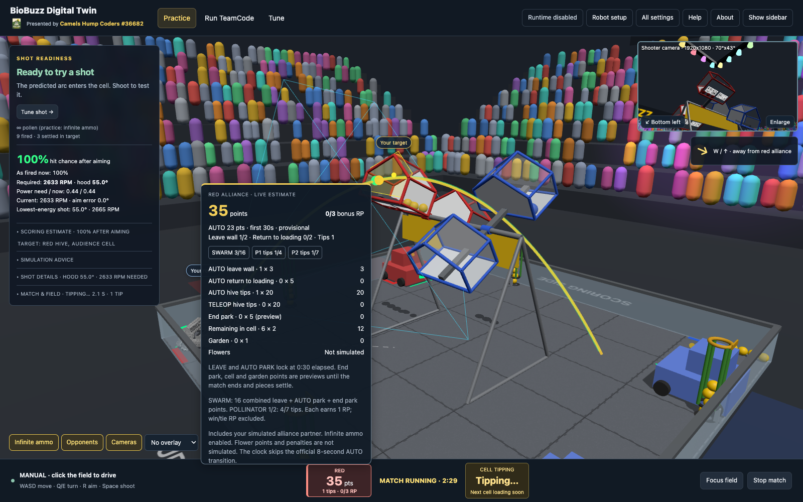

# BIOBUZZ Digital Twin

<a href="https://camelshumpcoders.org"></a>

A browser-based 3D digital twin of the FIRST Tech Challenge 2026-27 **BIOBUZZ** field and of our robot, plus a virtual runtime that runs the team's unmodified Java TeamCode against it. Built and shared by the [Camels Hump Coders](https://camelshumpcoders.org), FTC Team #36682, a rookie team of middle- and high-school students from Huntington, Vermont. MIT licensed.

**Standalone, in any browser (no install):**

- see exactly what the robot's cameras see from any spot on the mat: field-of-view footprint, frustum, which AprilTags are in frame and which the hive or other robots occlude;
- read off the hood angle, exit speed, flywheel RPM and arc needed to launch POLLEN or NECTAR into the upward-facing CELL from wherever the robot stands, with a Monte-Carlo hit probability and field-wide reachability and hit-probability maps;
- drive (mecanum or tank, keyboard or gamepad) in a scored match against scripted partner and opponent robots: hives tip, balls fly, bounce and settle, pins are called, LEAVE / PARK / tip points tally per Table 10-2, the field audio of a real match plays (Cavalry Charge, buzzers, the announcer's "3-2-1", bells, whistle) and the clock holds for the 8 s AUTO→TELEOP transition; the intake has to run to collect, and only brushes pull POLLEN out of a FLOWER;
- pick a starter robot profile or build your own (goBILDA StarterBot CAD in 6WD or Strafer mecanum, archetypes, colours), place cameras and the launcher by dragging, and replay any moment of a run with the timeline slider.

**With the local host (`pnpm sim`, server mode):**

- run your Android Studio TeamCode unchanged: INIT / START / STOP from the browser, encoders, IMU, AprilTag detections and gamepads from the sim, the real FTC Panels dashboard fed by your code;
- edit the OpModes' JSON settings in a schema-aware editor (help text, dropdowns, sliders, validation), bind robot measurements to the twin, calibrate the launcher against real shots, and save settings back into the repo;
- let coding agents test scenarios headlessly (`pnpm twin-test`), inspect and steer the live session through a local HTTP API, and keep the twin's settings in a versioned file next to your code;
- find out before deploying what the real robot would do: a motor model with surface friction and turning scrub (a 14 % finishing turn stalls with stuck encoders and a stall current, as it did on the robot), a feeder that moves a ball along a throat instead of launching on a pulse edge, camera faults (misread and duplicate tag ids, latency, dropout) and physical tag covers, and a run manifest that says which robot, physics, camera and settings a result belongs to and where every setting came from.

Field geometry comes from the Competition Manual (TU02, Section 9) and the Event Field Setup Guide v1.0.
See `docs/superpowers/specs/2026-10-04-biobuzz-digital-twin-design.md` for the numbers used and the design.

**Try it in the browser:** the twin is a static web app, published to GitHub Pages from `main` at
<https://digital-twin.camelshumpcoders.org/> (see [Hosting](#hosting-github-pages)). Driving, cameras, launcher
analysis and the match simulation all run in the page; only running your Java TeamCode needs the local host below.

## Set up

You need Node 22, pnpm 12 and, only for the virtual runtime, a JDK (17 or newer). The repo carries a [flox](https://flox.dev) environment that provides all of them (plus Gradle and Python 3), so the quickest path is:

```bash
git clone git@github.com:camels-hump-coders/biobuzz-digital-twin.git
cd biobuzz-digital-twin
flox activate          # drops you into a shell with node, pnpm, java and gradle on PATH
pnpm install
```

Without flox, install Node 22 and pnpm yourself (`corepack enable && corepack prepare pnpm@latest --activate`), and point `JAVA_HOME` at a JDK 17+ if you want to run TeamCode (Android Studio's bundled JDK is picked up automatically when `JAVA_HOME` is unset).

## Run the twin

```bash
pnpm dev          # http://localhost:5173
pnpm test         # unit tests for geometry, ballistics, kinematics, camera math
pnpm build        # static site in dist/ (also deployed to GitHub Pages, see Hosting)
```

Choose a workspace from the top bar:

- **Practice** puts Aim, Shoot, alliance, starting square, and practice balls first. Click **Try a sample setup** for a short move → aim → shoot walkthrough. **Restore my setup** brings back the configuration and position you had before the sample; its backup survives reloads in the same tab.
- **Run TeamCode** connects to the host and selects an Autonomous or TeleOp program. **Initialize (INIT)**, **Start**, and **Stop** stay in the bottom control bar; Stop remains available when you switch workspaces. The bar identifies manual versus TeamCode control and lets you assign the keyboard to Gamepad 1 or 2.
- **Tune** has **Shots**, **Cameras**, **Replay**, and a wider **Calibration** workflow. **Robot setup** is always available: starter profile cards (the two goBILDA StarterBots, a fast *Pollinator* mecanum turret bot, a heavy *Forager* 6WD pusher, and a blank 18 in box), the build (drivetrain, size, wheels, mass, intake side and kind) with a live readout of top speed, mass, footprint and an 18 in starting-configuration check, the chassis colour, plus launcher, camera mounts, and hardware map. The card that matches the robot on the field says so; a recoloured StarterBot is still a StarterBot, a changed build shows as custom.

The alliance scoreboard beside the clock in the bottom bar shows points, tips, and bonus ranking points in your alliance color. On the other side of the clock, **To tip our cell** shows how many additional pollen or nectar must land and remain in the raised cell, using its current load and configured tip threshold. These are alternatives; mixed loads count too. Hover, focus, or tap it for AUTO achievements, point contributions, and RP progress; Escape dismisses the breakdown. LEAVE and AUTO PARK lock at 30 seconds elapsed; end parking locks when the clock expires. When AUTO ends the clock holds at 2:00 for the official 8-second transition (the other robots sit still and manual driving is ignored; your TeamCode keeps running), then TELEOP begins. The twin plays the field audio of Competition Manual Table 9-1, synthesised in the browser: Cavalry Charge at the start, buzzer × 3 when AUTO ends, "Drivers, pick up your controllers, 3-2-1" from the announcer, three bells at TELEOP, a train whistle at 0:20, a 3-second buzzer at the end, a foghorn if the match is stopped, plus your own robot's shots and swallowed balls (the other robots are silent, so the sound tells you whether yours fired), hive tips and bounces. Volumes and audition buttons are in All settings → Sound; the transition hold is a Field & target setting. Cell and garden points are live end-state estimates. SWARM counts combined LEAVE and both PARK periods (16 points); POLLINATOR bonuses require 4 and 7 tips, using TU03 All Other Events thresholds. Solo practice cannot earn SWARM without a partner. Flower scoring, penalties, and win/tie RP are excluded; the clock skips the official 8-second AUTO transition. Starting again after expiry resets the field and score.

**All settings** keeps the complete control surface searchable. Advanced controls are grouped by purpose (geometry, motor & flywheel, shot variability, camera lens, individual hardware devices). Star a field to pin it in other workspaces; **Changed this visit**, per-field reset, and **Undo edit / Redo** help you experiment. Undo changes simulator configuration, never project files or the live robot position. A field reset returns to the value when the field was first built this visit. Workspace choice and pins are personal browser preferences, separate from the project's robot settings.

**Field view** (the compact box in Practice) groups view selection, camera preview, analysis maps and the visual extras (stadium, spinning wheels, CAD other robots); the full **View & overlays** section with every overlay checkbox lives under All settings. The hit map starts enabled for new visitors; saved overlay choices are preserved. Enabled maps display a legend; **Reduce visual detail** turns off the stadium, camera previews, and maps; **Restore visual detail** brings back the previous values. The HUD leads with shot readiness and a next action; hit chance, RPM, hood angle, and estimated power stay visible; detailed physics remain expandable. Labels identify your robot and selected target on the field.

Click or Tab to the field before using drive shortcuts. **Tab** then leaves the field normally; shortcuts do not capture settings inputs, dropdowns, or dialogs. **Help** lists the controls and reopens the walkthrough. **Hide sidebar / Show sidebar** explicitly shows the next action and hides or restores the workspace sidebar (also **H** while the field has focus). On a narrow screen the controls become a bottom sheet; close it to inspect the field. See [Controls](#controls) for all bindings. Settings persist in the browser and, in server mode, can be saved to a project file.


## Gallery

To regenerate from the current working tree without connecting to a robot or writing team files, start `pnpm dev -- --port 5180`, then run `pnpm gallery -- --port 5180 --demo-runtime`. Runtime and settings images below use the labelled demo fixture; calibration uses example measurements. For real TeamCode captures, start a dedicated `pnpm sim --built --wip --no-browser --no-panels --port 5180 --host-port 8780` and run `pnpm gallery -- --port 5180 --host-port 8780`. Use `--only overview,match-score` to refresh selected images. See `.claude/skills/readme-upkeep`.

| | |
|---|---|
|  |  |
| **Practice workspace.** Primary Aim and Shoot actions sit beside the field. Shot readiness, probability, RPM and hood angle stay visible; advanced controls remain available in Tune and All settings. | **Robot camera.** Press 4 for the selected webcam view. This capture turns off analysis overlays so the AprilTags are unobstructed; lens and mount settings determine the framing. |
|  | |
| **Robot setup.** Start from a profile card (goBILDA StarterBots, Pollinator, Forager, blank box), read the build's top speed, mass, size and 18 in check, choose intake side and kind, then a chassis colour; the field robot updates as you go. | |
|  |  |
| **Top view.** Camera ground footprint, FOV frustum, the launch line and the loading zones; shift-click anywhere to teleport and auto-aim. | **Hive physics.** Balls fly, bounce and settle in the cell without overlapping; at the calibrated load the detent lets go and the hive swings as a damped hinge driven by the balls riding in the cell (heavier loads tip faster), pouring the pieces out as the floor steepens. |
|  |  |
| **Hit-probability map.** From every 6 in square, aim and fire 40 simulated shots with your shot variability: green always scores, red never; dimmed where the selected camera cannot see the target cell's AprilTags. | **Run TeamCode.** Select the OpMode first, then read Logs & telemetry directly below. Sync/save cards remain accessible, while lifecycle controls and the alliance scoreboard stay in the bottom bar. This capture uses illustrative demo telemetry. |
|  |  |
| **Settings editor.** A demo profile shows schema-aware fields, project values, simulator overrides, and linked twin measurements. Review changes shows before/after values before Save to project writes files. | **Replay.** Drag or step through the latest INIT→STOP run: robots, balls, hive tilts and the telemetry of that moment come back; the live sim pauses until **Return to live**. |
|  |  |
| **Shooter calibration.** Record measured impacts, then review the fitted efficiency and hood angle before applying them. This image uses example measurements to illustrate the workflow. | **Match scoreboard.** Alliance-colored points, tips and bonus RP sit beside the clock. Hover, focus or tap the score for AUTO objectives and point/RP details. The upper-right camera sits above the mecanum compass. |

## Run your TeamCode against the twin (virtual runtime)

Coders can test OpModes without touching the robot. `runtime/` is a desktop JVM host with an FTC SDK shim: your unmodified Java OpModes compile against it and run with INIT / START / STOP from the browser, reading encoders, IMU, AprilTag detections and gamepads from the sim and driving the simulated robot with their motor and servo commands.

Your code stays in your Android Studio project; nothing is copied or moved. One command builds it against the shim, starts the host, starts the twin and opens the browser already connected:

```bash
pnpm sim --team ~/dev/FtcRobotController     # project root, TeamCode module, or its java folder all work
pnpm sim                                      # later runs reuse the remembered path
```

Choose **Run TeamCode**, pick an OpMode, then use **Initialize (INIT) → Start** in the bottom bar. Initializing resets the field; Start begins the program and match clock together. The runtime controls explain whether the host is connected. Edit your Java in Android Studio and save: the host recompiles and restarts within a few seconds and the browser reconnects, so you never leave the twin. Options: `--exclude "**/roadrunner/**,**/Old*.java"` to skip files that use SDK classes the shim lacks, `--no-watch`, `--no-browser`, `--port`, `--host-port`. The JDK is taken from `JAVA_HOME`, or Android Studio's bundled one if that is missing.

The host also runs the **real FTC Panels dashboard** (com.bylazar, the same library your code uses on the robot): open http://localhost:8001 from the *Open Panels dashboard* link in the Runtime panel. Telemetry, graphs, field drawings, configurables and OpMode control all come from your code's own Panels calls, fed by the simulated robot, so what Panels shows for the twin is what it would show for the robot. There is no camera video: the twin does not stream pixels (see *Known simplifications*), so a camera-stream widget stays blank.

See `runtime/README.md` for the hardware-map setup, keyboard-as-gamepad bindings, what the shim covers and the wire protocol. Three sample OpModes ship with it: a mecanum TeleOp, an AprilTag auto-aim autonomous and the shooter-calibration OpMode (see *Launcher model*).

**Long sessions next to an editing agent:** `pnpm sim --built` serves a production build of the *committed* tree (HEAD, exported with `git archive` and cached per commit) instead of the dev server, so edits to the twin's sources, committed or not, cannot change or hot-reload the page under a running OpMode (`--wip` builds the working tree, `--rebuild` forces a build). `pnpm twin-test` does this by default (`--dev` opts out).

**If the machine stalls while `pnpm sim` starts:** the first seconds compile the host with Gradle while the browser loads the twin; the build is capped at four workers and a 1 GB daemon heap (`runtime/gradle.properties`), the host JVM at 768 MB, and headless `pnpm twin-test` renders with a two-thread software renderer at 4 frames a second (it is not niced: its 50 Hz sensor packets need normal priority or they arrive in bursts). Running several headless runs at once, or a second Gradle daemon from Android Studio, is what usually hurts; `ps -axo pid,pcpu,command | grep -E "java|chrome-headless"` shows who is busy.

## What the robot taught the twin: friction, feeding, camera faults, provenance

The first physical runs of a route that was green in the twin failed in four ways the twin could not show: a turn finished at 14 % power stalled with stuck encoders and 1.4 A per motor, a 0.4 s feeder pulse did not bring the ball to the flywheel, AprilTag readings mixed the raised and lowered cells, and the headless robot was not the saved robot. The twin now models each of these; the design and the numbers are in `docs/superpowers/specs/2026-10-09-physical-fidelity-fixtures-design.md`, the regression fixtures in `scenarios/physical/`.

**Drive physics (All settings → Physics & feeding).** Under TeamCode the drive goes through a goBILDA 5203 torque/speed model with battery sag and three resistances: rolling, static breakaway and skid-steer turning scrub. The *Foam tiles* profile (the default for new sessions; marked *estimate*) is bracketed by the session: 14 % stalled, 20 % crept, 25 % turned, so the panel tells you the breakaway for your robot (about 18 % turning, 7 % straight for the two-motor StarterBot), the HUD raises **Not moving: …** with the command, the current and the breakaway whenever your code commands the drive without the shafts turning for half a second, the timeline records a `stall` event, and `DcMotorEx.getCurrent()` returns the modelled current. *Ideal* keeps the old kinematic drive (every command moves the robot) for fast route checks; *Custom* exposes every knob. Scrub is an estimate inside a 0.30–0.50 band: sweep it before trusting a finishing power. Mecanum chassis get the breakaway and current, not the skid-steer scrub.

**Feeder transit.** A feeder command moves one ball along a throat (default 3.5 in at 0.65 m/s × |power|, so 0.69 s at 20 %); nothing launches on a pulse edge. A 0.4 s pulse leaves the ball part way and the next pulse continues from there; an empty hopper feeds nothing; the flywheel loses 8 % per launch. The HUD's Shot details show **pulses · launched · scored** as three numbers and where the staged ball is; `/api/state` carries them. Positional feeder servos get one stroke per rising edge. The CR feeder's direction is a wiring fact: set `feedDirection` (±1) on the device in the exported hardware map if only one direction feeds; by default either does.

**Camera faults and tag covers (All settings → Camera faults).** The perception level is *Ideal geometry* (every visible tag with its true pose), *Parameterised faults* (dropout, latency that keeps each frame's true acquisition age, pose noise, misread ids such as `44>45`, duplicate ids, blur above a yaw rate, a minimum tag size) or *Individual tags* (no SDK clusters). Faults are decoder faults: the stickers keep their ids and poses, the timeline records when a fault engages, and a misread flows through whatever TeamCode asked the SDK for. The shim follows SDK 12 here: an `AprilTagProcessor` built on the game library gets one `AprilTagClusterDetection` per visible cell whose pose is the SDK's cluster origin (the plane of the opening, 5.6 in above and 7.19 in in front of the sticker strip, recovered from every visible tag), while a processor built on a custom library of individual tags gets `AprilTagSingleDetection`s with their own poses and timestamps, so a team's own consensus code (the robot's `TagClusterConsensus`) runs in the twin on the same observations it sees on the field, misreads and duplicates included. Pixel decoding is not available and is reported as unsupported. Tag covers are physical plates over chosen stickers (per tag, or *Cover cell*), drawn in the scene and occluding the tag, the operator's experiment of covering the lowered cell.

**The profile the robot saved, and the one it was shipped (All settings → TeamCode settings → Saved hub profile).** On the Control Hub the code reads the robot profile it last *saved*, not the packaged asset, so a profile saved by an older build has none of the keys added since and the code's parser fallbacks decide them: a 60° launch angle in the committed file did nothing on the robot while the saved profile had no `launchAngleMeasured`. The twin models that upgrade case: build the saved copy from the packaged file minus the keys it would lack (or give the whole document, or a past git revision in a scenario), INIT, and the Runtime section's *Effective configuration* marks every such key **missing (parser fallback)** next to the packaged, saved, overridden and bound ones, and says whether the shot calibration is the twin's solver through bindings (synthetic) or the profile as configured. Scenarios state it as `persisted`, assert it with `requireEffective … "<missing>"`, and `bindingsPolicy: "reject"` turns any bound calibration into a setup failure for real-profile parity runs.

**Visual quality for slow machines (View & overlays → Visual quality).** *Auto* (the default) measures the first seconds of each session and, below 30 fps, switches the page to *Performance* visuals and says so on the HUD; *Performance* can also be chosen outright. It keeps the robot preset but draws the procedural box instead of the CAD, and turns off the stadium, shadows, the hit map, camera insets and spinning wheels, at 1× pixel ratio; physics, sensors and the manifest's robot are unchanged (the manifest records the render mode). The choice lives in that browser only: it is never written to `twin-settings.json`, and loading the repo file does not change it, so a Chromebook's setting does not reach the repo. The headless test bed (`?ci=1`) always runs this way, plus all overlays off, and never persists anything.

**Reload from disk, and bound values to disk.** *TeamCode settings* has a *Reload from disk* button (per file, and for all files) that throws away the browser's overrides and any simulated saved profile and asks the host to read the asset files again, so a `git pull` or an edit made elsewhere shows up without restarting anything. INIT again to run with the reloaded values. A file can still differ from disk afterwards when the twin's **bound** values (its measurements, such as the solver's shot range and power table) are newer than the file; the panel says which keys, and *Write bound values to disk* writes just those into the asset files so the repo catches up with the twin, leaving any browser edits as overrides. The other direction is *Adopt file values into the twin*: it sets the twin's knobs so the bound values equal the file (a camera pitch, the hood angle, the chassis size, a mirrored side), after a review that also lists what cannot be adopted because the twin derives it (the solver's shot range and power table follow from the hood angle and exit height, so adopt those and the calibration follows the file's physics).

**Loose balls hold the robot.** A chassis that pushes a ball against the perimeter wall (or against another ball that is already against it) is held by it: the drive model takes an immovable contact and the surface grip (`tractionMu`, 1.2 for gecko wheels on foam, an estimate) decides whether the shafts stall with a rising current or the wheels spin in place with the encoders counting, both without chassis progress. The timeline records a *contact* event with the ball count and position; the ideal profile stops kinematically. It is what the operator saw when the route backed into the garden row before firing; it is not a measured garden pile.

**World truth beside telemetry.** `window.__twin.truth()` and every twin-test sample carry the geometric distance from the robot centre and from the launcher exit to the target opening, the bearing and the opening height, so a range the code reports can be compared with where the robot actually stands (`expect.rangeConsistency`), a leg can be asserted as measured displacement and heading change (`travelBetween`), and "the flywheel never spun" is a claim about commanded outputs (`flywheelMaxPower`). A detector frame-rate fault (`fpsCap`, the C270 ran about 12 fps at decimation 1) holds each processed frame until the next one so acquisition stamps age as they do on the robot.

**Run manifest.** Every INIT records the effective configuration: robot preset, dimensions, drivetrain, intake side and kind, cameras with mount and field of view, launcher, hardware map with roles, ports and mirrored side, physics profile with provenance, perception level and covers, the twin's and the TeamCode checkout's git revisions, and every TeamCode setting with its source (`packaged` file, `manual` or scenario override, `bound` twin binding). The Runtime section shows it (*Effective configuration*, with a copy button), `GET /api/manifest` returns it, the timeline keeps it as a `manifest` event and every twin-test report includes it, so a passing run can never quietly be the wrong robot or the twin's own calibration.

## Test bed for coding agents (and CI)

`pnpm twin-test` runs one OpMode headlessly against the twin from a scenario file, injects gamepad inputs at simulated times, checks expectations and writes a JSON report with telemetry, pose, shots and errors:

```bash
pnpm exec playwright install chromium                      # once
pnpm twin-test --team ~/dev/FtcRobotController --scenario scenarios/example-teleop.json
pnpm twin-test --team ~/dev/FtcRobotController --scenario a.json --scenario b.json --out-dir reports/   # one host start for the whole batch
```

Scenarios (`scenarios/scenario.schema.json`) choose the OpMode, alliance, robot and hardware presets (or `"twinSettings": true` to run the robot the human saved in `TeamCode/twin-settings.json`), asset overrides, start pose, inputs and `expect` checks (`noErrors`, `shotsFired ">=1"`, `telemetryIncludes`, `movedAtLeastIn`, …). They can also set the physics profile (`"physics": "tiles" | "ideal"` or an object), feeder knobs (`feed`), the perception level and faults (`perception`), `tagCovers`, event-relative `faults` (`{"at": {"telemetry": "AIM_SHOOT"}, "durationS": 6, "perception": {"faults": {"misreadIds": {"44": 45}}}}`), `requireEffective` (the setting values TeamCode must actually read at INIT, else setup fails naming the effective value and its source) and `coverage` (a level the twin cannot provide, such as pixel perception, makes the run UNSUPPORTED instead of silently ideal). Physical-outcome checks: `launches` (balls that reached the flywheel), `feederPulses`, `collectedAtLeast` (game pieces that entered the robot), `stalls` / `noStall`, `footprintInside` (a zone such as `loading`, with `require: overlap | center | all`), `outputsZeroAfterStop`, `eventWithin` (after a telemetry line, an event such as `stall`, `launch` or another line within N seconds). Every check gets a verdict, pass / fail / inconclusive / unsupported: a run the machine could not keep near real time (under 0.8× or seconds of held sensor packets) makes the physical checks inconclusive rather than green or red. Reports carry the `manifest`, the `events` (stall, feed, launch, fault, status) and the `timing`. It uses ports 5190/8790 so a running `pnpm sim` is not disturbed. Starting the host (Gradle plus the JVM) is the slow part, so pass several scenarios in one call: they share the host and each gets a fresh page; the exit code is 0 only if all pass. Headless, the simulation runs at real time (the run prints `simulated 30.0 s in 30 s wall`), so a scenario costs its `durationS` plus a few seconds.

**Agent skill.** `skills/biobuzz-twin/SKILL.md` teaches a coding agent (Claude Code, Codex, Cursor and the other agents the [skills](https://skills.sh) CLI supports) to find the twin, check it is installed, run the team's code through it and read the report. Two ways to install it into a team repo:

```bash
# 1. straight from this GitHub repo with the skills CLI (run inside the team repo)
npx skills add camels-hump-coders/biobuzz-digital-twin --skill biobuzz-twin            # prompts for the agents to install to
npx skills add camels-hump-coders/biobuzz-digital-twin --skill biobuzz-twin -a claude-code -y   # no prompts
npx skills add camels-hump-coders/biobuzz-digital-twin --skill biobuzz-twin -g         # user-wide instead of this project
npx skills update                                                                       # later, pull the newest version

# 2. from a local checkout of this repo
pnpm skill:install ~/dev/FtcRobotController     # copies to <team>/.claude/skills/biobuzz-twin and writes .biobuzz-twin.json
```

`npx skills add ... --list` shows what the repo offers. The CLI install does not know where your twin checkout is; the skill then looks for a sibling `biobuzz-digital-twin` directory or clones one, so optionally add `.biobuzz-twin.json` (`{ "twinPath": "/path/to/twin" }`) to the team repo root to point it somewhere else. Commit the skill files; from then on "run this through the twin" is something every teammate's agent knows how to do.

## Agent API: let a coding agent look at (and steer) your live session

While `pnpm sim` runs, the host serves a small local HTTP API next to its WebSocket port (default http://127.0.0.1:8766/, shown in the Runtime panel; `GET /` lists everything). A coding agent on the same machine can debug what you are seeing without screenshots or copy-pasting:

```bash
curl -s http://127.0.0.1:8766/api/status                      # runtime status, OpMode, error, OpMode list
curl -s http://127.0.0.1:8766/api/snapshot?seconds=30         # the Timeline panel's Markdown snapshot
curl -s http://127.0.0.1:8766/api/state                       # pose, match, score, inventory, hives, telemetry
curl -s http://127.0.0.1:8766/api/telemetry ; curl -s 'http://127.0.0.1:8766/api/log?tail=200'
curl -s -X POST http://127.0.0.1:8766/api/overrides -d '{"biobuzz/robot-profile.json": {"matchAuto.startPosition": "FAR_SIDE"}}'
curl -s -X POST http://127.0.0.1:8766/api/twin -d '{"alliance": "red", "robot.launcher.elevationDeg": 52}'
curl -s -X POST http://127.0.0.1:8766/api/match -d '{"action": "init", "opMode": "BioBuzz: Drive + Auto Aim"}'   # then start / stop / reset
curl -s -X POST http://127.0.0.1:8766/api/gamepad -d '{"pad": 1, "values": {"a": true}, "holdMs": 300}'
curl -s http://127.0.0.1:8766/api/manifest                    # the effective robot, physics, camera and every setting with its source
curl -s http://127.0.0.1:8766/api/capabilities                # schema version, perception levels, physics profiles, assertions, what is unsupported
curl -s -X POST http://127.0.0.1:8766/api/twin -d '{"physics": "tiles", "perception.level": "faults", "perception.faults.misreadIds": {"44": 45}, "tagCovers": [38, 39, 40, 41]}'
```

Settings an agent applies show up in the panel immediately (and in the timeline as a note), exactly as if you had typed them, and are sent to TeamCode at the next INIT. If the agent cannot reach your machine, it can instead print the settings as `"key": value` lines; paste those into the **Paste settings from an agent** box in the TeamCode settings panel, which picks the right file and applies them. Localhost only, no authentication: anything on your machine can drive the session.

## Timeline & logs: go back in time, hand a moment to an agent

Telemetry changes faster than anyone can read, so the twin records the last ~10 minutes at 10 Hz: telemetry, runtime status, pose, match state, held gamepad buttons and sticks, shots, score, the other robots, every ball and the hive tilts, plus events (status changes, Home/button presses, shots, host console lines from your OpMode and `RobotLog`, exceptions with their stack traces, fouls). **Tune → Replay** puts a timeline below the field, with events and telemetry in the side panel. Its slider that **replays the run on the field**: drag it back and the robots, balls and hives move to that moment, the telemetry box shows what the OpMode printed then (marked ⏪; telemetry lines are colour-coded by well-known words, so errors are red, warnings amber and good states green) and the HUD's Match row says REPLAY; the live simulation pauses while you look and resumes when you press **Return to live**. Driving does not silently leave replay. Step buttons move 0.1 s or 1 s at a time, *Play* replays at real speed, *Run start* jumps to the latest INIT, and the slider covers the latest INIT→STOP run by default (*Everything* widens it to the whole recording). Click an event to jump to it. This works standalone (no host needed); in server mode every finished run is also saved under `runtime/runs/` and agents can scrub your view or fetch any moment through the agent API (`/api/run`, `/api/replay`, `/api/runs`). **Copy last 30 s / 2 min** puts a Markdown snapshot on the clipboard: context (OpMode, presets, hardware map, asset overrides and bound values, camera mounts, start positions), the event list, and the telemetry at every change in the window. Paste it to a teammate or an agent. *Download full log* saves everything as JSON.

## TeamCode settings with help, dropdowns, sliders and validation

Open **Run TeamCode → TeamCode settings → Open settings editor**. Fields show **From project**, **Modified in simulator**, or a link to their source in Robot setup. Edits affect the next INIT; **Review changes** previews affected files and values, and **Save to project** is the explicit write. **Keep in simulator** cancels the write. Bulk JSON paste and the full technical catalogue remain available as advanced tools.

The TeamCode settings section summarises your JSON assets (files, overrides, bound values, invalid values, whether disk differs) and opens a full-width **settings editor** dialog with search, per-file sections, Save/Export/Copy and the paste box, so long descriptions and enum lists are readable. A bare JSON value does not say what it means, what range is sane or which enum strings the code accepts. Put a **JSON Schema sidecar** next to each asset (`robot-profile.schema.json` beside `robot-profile.json`, shipped by the host like any asset) and every setting gets a description under its row, enums become dropdowns, `minimum`/`maximum` become a slider with an exact box, integers snap, defaults are shown, and anything outside the schema is flagged red with the reason (the file badge counts invalid values). The filter searches names, descriptions and enum values, so "start square" finds `matchAuto.startPosition`. Agents get the same through `GET /api/schema`, and the skill asks them to update the schema whenever they add or change a setting in the Java that parses it. The Camels Hump repo now carries schemas for both profile files, seeded from the ranges and enums its parsers enforce.

## Twin bindings: one source of truth for robot measurements

Your OpModes carry settings that describe the physical robot (wheel diameter, ticks per revolution, track width, camera mount, alliance, shooter direction). The twin models the same facts. `TeamCode/twin-bindings.json` in the team repo says which asset key is derived from which twin knob; the twin evaluates it whenever a knob changes and feeds the results to your code at INIT as asset overrides, marked ⇐ in the TeamCode settings panel. Measure once, in the twin, and the sim and your code can never disagree.

```json
{ "version": 1, "bindings": [
  { "asset": "biobuzz/robot-profile.json", "key": "wheelDiameterIn", "twin": "robot.wheelDiameterIn", "round": 3 },
  { "asset": "biobuzz/robot-profile.json", "key": "camera.pitchDeg", "twin": "hardware.webcam_1.pitchUpDeg" },
  { "asset": "biobuzz/robot-profile.json", "key": "tagTracking.alliance", "twin": "upper(alliance)" } ] }
```

Expressions use knob names, numbers, `+ - * / ( )` and `round abs min max upper lower`; `map` translates values and `round` rounds. *Download twin knob catalogue* in the panel lists every knob with its current value: `robot.*` (dimensions, wheels, mass, drivetrain), `camera.<name>.*` and `hardware.<webcam name>.*` (mount in inches, pitch both signs, yaw, roll, FOV), `launcher.*`, `hardware.<device>.*` (port, ticks, free RPM, direction sign), `start.*`, `alliance`, `hive.*`. The committed asset files are still what runs on the robot. When you like the values (overrides you typed, bound values from the twin, calibration results), press **Save to project** in the TeamCode settings panel (server mode, i.e. with `pnpm sim` running): after a confirmation listing every change, the host writes each changed file into your `TeamCode/src/main/assets` folder with the values written in, keeping the file's key order and indentation so the git diff shows only what changed, and clears the now-redundant overrides. Review the diff and commit. Without a host, **Export** downloads the same files for you to drop in by hand. Agents can do the same with `POST /api/save`.

## Match flow

The field loads in **setup**: every robot parked on its starting mark (Field & target → *Starting positions*, mirrored when you play blue; by default you start on the half of the field our hive's raised cell faces and the partner on the other), pieces at match start, the other robots idle. **Start timed match** in the control bar releases the 2:30 clock and the scripted robots; **Stop match** freezes them; **Reset to start** parks everything again and puts the field back exactly as the rules set it up: red hive audience cell up, blue hive scoring cell up, 3 NECTAR staged in each raised cell, flowers and gardens full, 4 POLLEN preloaded (the T key and the hive selectors are for practising other states and are overridden by a reset). With TeamCode connected the Driver-Station buttons do the same for the whole field: INIT resets the board, START starts your OpMode and the match together, STOP ends both.

**Scoring** follows Competition Manual §10.5, Table 10-2, and appears beside the clock in the alliance scoreboard, in the HUD's *Score* row, and in timeline snapshots: HIVE TIP 20 (tips completed in the first 30 s count as AUTO), LEAVE 3 per robot no longer touching the perimeter wall at the end of AUTO, AUTO PARK 5 per robot at least partially in its alliance's LOADING ZONE at the end of AUTO, TELEOP PARK 5 at the end of the match, 2 per POLLEN/NECTAR left in an upward cell, 1 per ball in the GARDEN. The row also tells you your own robot's LEAVE / PARK status live, so you can check an autonomous routine earns what you expect; LEAVE and AUTO PARK are latched when the clock passes 0:30 of AUTO (2:00 left), PARK when the match ends. Both LOADING ZONES are taped on the mat (23 in by 11 in, in the corner next to each alliance area). The scripted robots drive to their LOADING ZONE in the last 12 seconds. FLOWER points are not modelled.

## Saving, sharing and resetting

**Server mode keeps the settings in a file.** With `pnpm sim --team …` running, the **Settings & session** section in All settings shows the twin's settings file, `TeamCode/twin-settings.json` next to `twin-bindings.json` (under `runtime/` without a team). A status badge says whether this browser is in sync with the file, has unsaved changes, or is behind a file that changed elsewhere, and only the button that makes sense is enabled: *Save to project file* writes every setting in the panel there in a stable, sorted JSON so it diffs cleanly and can be committed and shared (match state is left out: which cell is up, the robot's pose and clock, and the commanded RPM or hood angle while *Auto-RPM* or *Auto-hood* drives them, so a tip or a drive around the field never makes the file "unsaved"; when the badge does report a difference it lists the settings that differ); *Load from repo file* applies it. By default the file is applied when the host connects unless the browser holds unsaved changes. Saves and loads confirm with a toast. The browser's storage still works on its own for the standalone (no server) twin. Agents use `GET/POST /api/settings`.


Everything in the side panel is also kept in the browser's localStorage, which is all the standalone twin uses. **All settings → Settings & session** (also **Settings & files** in the footer) has:

- *Export robot config* / *Import robot config*: a JSON file with the robot preset, dimensions, cameras, launcher, shot variability, hardware map and game-piece settings. Share it across browsers or commit it next to your TeamCode.
- *Export whole session* / *Import whole session*: everything, including pose, view and overlay toggles.
- *Reset session to defaults* (behind *more*): clears the saved state and reloads, keeping your TeamCode asset overrides unless you tick the box beneath it. *Reset robot to preset* only puts the robot back to its preset.

## Controls

| Key | Action |
|---|---|
| W / S | drive forward / back |
| A / D | strafe (mecanum only) |
| Q / E or ← / → | rotate |
| Shift | boost to full speed |
| Space | launch a ball with the current hood angle and RPM |
| I | switch the intake on or off (K runs it while held; LB / LT on a gamepad) |
| [ / ] | hood angle down / up (dpad left / right); takes Auto-hood off |
| − / = | flywheel command down / up, 0 stops it (dpad down / up); takes Auto-RPM off. The wheel spins up at about 4000 RPM/s and coasts down at 1500 RPM/s, so a shot right after a change leaves slow |
| T | flip which cell of our hive is up (resets that hive) |
| R | turn the robot toward the target at its own turn rate (any turn key takes over); shift-click teleports still snap |
| F | toggle field-centric driving |
| 1 / 2 / 3 / 4 | orbit / top-down / chase / robot-camera view |
| H | hide or restore the side panel (field focused) |
| Tab | move focus through the interface; select keyboard Gamepad 1/2 in the bottom bar |
| Shift+click or double-click on the mat | teleport the robot there and aim at the target cell |

Gamepad: left stick drive, right stick rotate, A launch, B aim at target, Y flip target, X field-centric, right trigger boost.

## Mat overlays

Two field-wide maps live in **View & overlays**:

- **Reachability map**: the flywheel RPM needed to hit the target cell from each 6 in square (green low, red near the maximum, dark unreachable).
- **Hit-probability map**: from each square, aim at the target, take the hood/RPM the launcher would need from there and fire 40 simulated shots with the configured shot variability; the square is coloured by the fraction that land in the cell. Squares are dimmed where the selected camera would not see any of the target cell's AprilTags, since auto-aim could not lock on from there. The map fills in over a few seconds and recomputes as you change the launcher, variability, hood angle, cameras or target, so you can watch a camera FOV or mount change open up or close off parts of the field. The map for the cell that is down is computed in the background once the current one is done, so when the hive tips (or you press T) the map swaps instantly instead of starting over.

**Performance stats** (same section) shows how long each part of the frame takes.

## Experiment: hood angle and camera field of view

The Practice workspace puts the two knobs a new user should play with first on their own card, first a **StarterBot drivetrain** switch (mecanum or 6-wheel tank, both goBILDA StarterBots so everything else stays comparable), then bounded sliders: **Hood angle** (0 to 89°) and the selected **camera** model with its **field of view** (30 to 160° diagonal). Slide the hood and the hit chance tile and the hit map follow: too flat or too steep scores from nowhere, in between there is a sweet spot. Change the camera, or slide the field of view (which turns the pick into a *Custom* camera at the resolution it had), and the camera preview and the AprilTags row show the trade-off between seeing more of the field and reading tags further away; the **mount pitch** and **mount height** sliders below them show which tags the camera can see at all from where it sits. The guided sample setup's last three steps are on this card. The full controls, including the adjustable-hood range and per-camera mounts, stay in the Launcher and Cameras sections.

## What the HUD tells you

The HUD leads with **Shot readiness**: whether to aim, move, adjust the launcher, or try a shot. After the first shot the guide moves on to what a new driver has not done yet: drive (W / S), turn (Q / E), then switch the intake feeder on (I, with a button) and collect a ball; driving over a ball with the intake off also raises a notice with a *Turn intake on* button. **Scoring estimate** expands the probability after aiming and spinning up, its confidence interval, and the current-direction prediction. The estimate is conditional, not a guarantee that the next ball will settle in the cell. Fired and settled counts provide actual simulation feedback. Shot details, Match & field, Robot, and AprilTags retain the exact values. Attempting to shoot with no balls produces a prominent warning. Passing a collectible ball with free capacity and the intake off shows an intake warning above shot readiness. Performance advice includes Reduce visual detail, with Restore visual detail available afterward. During replay, the field and telemetry show the recording; shot analysis is explicitly labelled as live analysis.

- **Range** and **bearing error** from the launcher exit point to the aim point (centre of the up-cell opening, 2 in inside).
- **Required exit speed / RPM** for the current hood angle. With *Auto-RPM* on, the commanded RPM tracks this as you drive.
- **Two arcs**: green/red is the arc *if the robot were aimed* at the target with the current hood angle and RPM; orange is the arc along the direction the launcher *actually points right now*. They coincide once you press R or turn to face the target. Either can be switched off in View & overlays.
- **Shot variability**: every fired ball draws random exit speed, elevation, yaw and spin errors (1-sigma values in the Launcher panel, defaults 3 %, 1°, 1°, 20 %). The HUD **hit probability** re-simulates 150 perturbed shots from the current pose and shows the hit fraction with a 95 % confidence interval and the mean miss distance; the dot cloud on the opening plane shows where each lands (green hit, red miss).
- **Unlimited practice balls** (Practice, also **Infinite ammo** in Launcher) keeps a ball of the selected kind loaded so you can play with hood angle and power without collecting; off by default, where the match model below applies.
- **Match pieces.** The field starts as at competition: 4 POLLEN preloaded on the robot, 4 in each FLOWER, 4 in each GARDEN, 3 NECTAR in each raised cell, 5 NECTAR per alliance in reserve. You can only launch what you carry (capacity 4 by default, POLLEN/NECTAR handling configurable in the Field panel). Balls enter only through the intake side (Robot panel: front/rear/left/right, mouth width and intake kind; the bar on the floor outline marks it: green while the intake runs, red while it is off) and only while the intake runs: press **I** to switch it on or hold **K** (LB / LT on a gamepad), or power the intake motor from TeamCode. *Auto intake* in Field & target keeps it running whenever you drive by hand. Collection is by contact, not proximity: the intake is a feeder with two side wheels at the mouth ends and a roller just inside the edge, and a ball is pulled in only once one of them touches it, then travels to the seat inside the mouth before it counts (one every 0.35 s). With the intake off the roller line is a wall: the ball is bulldozed ahead of the robot, and so is a ball this robot may not take (*Can intake POLLEN / NECTAR* under Field & target → Game pieces, and never the other alliance's NECTAR); the HUD says which rule refused it. Pulling POLLEN out of a FLOWER's retrieval opening (bottom first, one every 0.3 s) needs an intake with **brushes** (the kit intake) and a wheel actually touching the bottom ball, so you drive the intake end into the FLOWER: the intake end of every robot is a low deck (*Intake deck depth* in the Robot panel, 2.75 in on the StarterBots) that slides under the FLOWER's mid ring into the cage until the wall-side post, while the tall body stops at the pipes; a plain roller only takes balls off the floor, and bumping the cage with any other side gets you nothing. On the goBILDA CAD the robot's own intake roller and the two side wheels are carved out of the mesh and turn while the intake runs (whatever the *Spinning wheels* toggle says: that one only concerns the drive wheels); the box chassis shows the same feeder as a roller and two flat discs. The HUD shows the intake state and warns when you drive over a ball or up to a FLOWER with the intake off. Any other side of the chassis pushes balls out of the way, and so does the intake once you carry the maximum. After every tip one reserve NECTAR appears in that alliance's LOADING ZONE. The HUD shows what you carry, FLOWER stocks and the NECTAR reserve; the small translucent dots above a robot are the same count, not loose balls. *Reset match to start* puts everything back.
- **Other robots score.** With *They collect and score* on, the partner (your alliance) and the two opponents (the other alliance) run a loop: collect from FLOWERS or loose balls, drive to a launch spot in front of their raised cell, turn their back to it (like the StarterBot they collect through the front and fire out over the rear ramp), fire with a noisy but calibrated shot, repeat. Each shoots only at its own alliance's hive and only picks up its own colour of NECTAR; switching *Our alliance* flips which robots are partner and opponents and mirrors their starting corners. Both hives count loads and tip, so ball availability and the cell you are aiming at change under you. They are also obstacles and occluders. **Difficulty** (Easy / Medium / Hard, under *Simulated other robots*) sets how well they play, never what they can see: Easy drives slowly, hesitates, reacts late, shoots two at a time from wherever it stops with sloppy aim and never parks; Medium runs cycles of three, counts to the tip (stops firing once the cell plus balls in flight will tip, re-targets while it swings) and parks at the end; Hard drives fast, fires full volleys from the sweet spot with tight aim, parks at the end of AUTO and of the match, and stands on your shooting spot when it has nothing to collect. Every tier keeps the same safety behaviour (stuck watchdog, pin back-off).
- **Hive tipping.** Balls that come to rest in the up cell count toward its load, shown in the HUD with the 3 NECTAR field staff stage there. Field staff calibrate cells to tip at 8 POLLEN or 3 NECTAR + 3 POLLEN, 198.6 g, so with the default 195 g threshold three POLLEN in tips it. The hive then swings over, faster the heavier the load (about 2.6 s at the threshold, under 1 s when well over), the balls ride the swinging cell and roll out as its floor steepens, and the other cell comes up facing the other side of the field, so you have to reposition to keep scoring. Tips and points are tallied in the HUD. Pressing T or choosing a cell in the Field panel resets the hive to match start. The threshold and the auto-tip toggle live in the Field panel. Once the load is reached the detent lets go and the tray swings as a damped hinge driven by the balls riding in the cell: a 200 g load takes about 3 s, heavier loads less; the HUD counts the swing down from the live angular speed. Balls never overlap each other, in the cell, on the floor or in flight.
- **Predicted HIT / MISS** for the current hood angle and RPM, with the height error at the target and the entry angle into the opening plane. The arc is drawn green (hit) or red (miss). If the launcher is not pointed at the target the arc shows what would happen once aimed.
- **Lowest-energy** solution across the hood's adjustable range, plus a fan of all feasible arcs. *Auto-hood* sets the hood to it.
- **Reachability map** (**Required RPM map** in View & overlays): colours every 6 in square of the mat by the RPM needed to hit the target from there with the current launcher. Green is comfortable, red is near the motor limit, dark red cannot reach. Use it to pick launch spots and to see what a fixed hood angle costs you.
- **AprilTags**: green = in frame, facing the camera and unoccluded; orange = in frame but blocked; hover for distance and apparent size in pixels.

## Cameras

**Placing cameras**: in orbit view drag a camera's green body across the robot to move it; hold Alt while dragging to raise or lower it. Use the *+ Rear camera*, *+ Left*, *+ Right* buttons for quick extra mounts (rear is yaw 180°, 7 in behind centre), then fine-tune the numbers. The inset always shows the selected camera, so a rear camera's view is one click away.

The StarterBot presets treat the hood side as the robot's front: the shooter camera looks forward at the cell, the launcher fires forward, and the roller intake is at the back, so at the start square the hood faces the field. *Flip forward direction (180°)* in the Robot panel makes the other end the forward arrow, moving the CAD, cameras and launcher with it, for teams that drive intake-first.

Pre-seeded FTC-legal UVC webcams with their published fields of view (Logitech C270/C920/C930e/Brio, Microsoft LifeCam HD-3000, Arducam OV9281/OV9782 global shutter lenses, Limelight 3A). Add as many mounts as you like; each has height, forward/left offset, pitch, yaw, roll and a FOV/resolution override. Every enabled camera gets its own inset, initially in the upper right for new visitors (click an inset to select that camera). Use **Upper right / Bottom left** to move the previews and **Enlarge / Smaller** to resize them; both preferences survive reloads. The mecanum compass sits below upper-right previews, or at the top when that corner is free. Press 4 to put the selected camera full screen. FTC allows at most two cameras on a robot, so the add buttons stop at two.

## Launcher model

Exit speed = *efficiency* x flywheel surface speed. Hooded single-wheel shooters measure roughly 0.30-0.45; dual opposing wheels around 0.85-0.9. Flight uses quadratic drag (Cd 0.45) and optional Magnus lift from backspin. Use the calibration wizard below to measure efficiency and hood angle on your robot instead of guessing. The solver aims adaptively: a steep descending arc targets the centre of the opening (aiming deeper would push its crossing toward the far lip), a flat or rising one up to 4 in inside the cell. Steep hoods are also sensitive: at 65 in a 1 % speed error moves the crossing about 0.9 in at a 55° hood but about 3.9 in at 75°, which is why the hit probability drops as you raise the hood.

### Calibrate the twin against your robot (Tune → Calibration)

The twin only predicts shots as well as its launcher numbers, so there is a guided way to measure them on the real robot:

The calibration workspace has **Setup → Measure → Review & apply** steps. Measurements survive moving between steps, and the fit previews current and proposed values before Apply is enabled.

1. Copy `runtime/samples/.../TwinCalibration.java` into your TeamCode (edit the hardware names at the top if yours differ; it already knows the StarterBot and Camels Hump names). It runs unchanged on the robot and in the twin.
2. Park the robot square to a wall with the shooter facing it and measure the bumper-to-wall distance and the ball exit height; type both into the wizard. The wizard proposes a plan: a few flywheel powers at two distances, two shots each (edit the lists to taste; keep `POWERS` in the OpMode equal to the wizard's list).
3. Run the OpMode: dpad steps the power, X spins the flywheel, A fires one ball. Each shot is announced as `CAL shot=N power=P rpm=R volts=V` on telemetry and in the log. Note where the ball hit: the height on the wall, or how far out it landed if it came down first (a tape on the floor is the easy measurement; high-power shots at 55° reach a wall 10 ft up).
4. Enter each shot in the wizard: paste the `CAL` lines (they arrive by themselves when the OpMode runs in the twin), click the side-view diagram where the ball hit, *Add shot*. The fitter runs after every shot and reports efficiency, hood angle and backspin with uncertainties, the RMS error, and what measurement would help next (the hood angle only separates from exit speed when the geometry varies: two distances, or a wall hit plus a floor landing).
5. *Apply to twin* writes the fitted values into the Launcher (and the flywheel's free speed into the Hardware map when the OpMode reported RPM). The wizard also prints the values TeamCode's range → power model wants (`launchAngleDeg`, `exitHeightIn`, a `powerTable`) and can send the scalar ones to the TeamCode settings overrides.

The session (setup and shots) is saved with the rest of the state and can be exported/imported as JSON. To try the wizard without a robot, run the calibration OpMode in the twin: the sim's own shots show up as *Sim ball* rows you can add as measurements (the perimeter counts as an infinitely tall wall for this), and the fit should land on the Launcher values you started with.

Presets: goBILDA StarterBot (single 96 mm Hogback flywheel on a 6000 RPM 5203 motor, fixed 55° hood, fires out the **back** over the ramp so *Launcher yaw* is 180°), dual flywheel with adjustable hood, custom. The orange exit marker on the robot can be dragged like a camera (Alt-drag for height) and is hidden from the camera views.

## goBILDA CAD

The StarterBot assemblies are published by goBILDA as STEP (about 420 MB each):

- 6WD: https://www.gobilda.com/content/step_files/3200-2627-0003.zip
- Strafer mecanum: https://www.gobilda.com/content/step_files/3200-2627-0004.zip

`scripts/step2glb.py` converts a STEP file to a web-sized GLB (drops parts under 10 mm, tessellates at 0.4 mm):

```bash
python3 -m venv .venv && .venv/bin/pip install cadquery trimesh numpy
.venv/bin/python scripts/step2glb.py 3200-2627-0004.step public/models/starterbot-mecanum.glb
.venv/bin/python scripts/step2glb.py 3200-2627-0003.step public/models/starterbot-6wd.glb
scripts/optimize-glb.sh starterbot-mecanum.glb public/models/starterbot-mecanum.glb   # 185 MB, 8 M triangles -> ~0.6 MB
```

The raw tessellation is about 185 MB with 8 million triangles; the optimise step welds, simplifies to about 320 k triangles and Draco-compresses it to roughly 600 KB, which is what is committed in `public/models/`. Use the *CAD yaw* field in the Robot panel if the model's front does not match the robot's forward arrow.

If a GLB is missing the app falls back to a procedural box with the same footprint and says so in the HUD.

## Hosting (GitHub Pages)

The browser part needs no server: `pnpm build` produces a static site in `dist/`, and `.github/workflows/pages.yml` builds and deploys it to GitHub Pages on every push to `main` (one-time setup: repository **Settings → Pages → Source: GitHub Actions**). The site lives at the custom domain <https://digital-twin.camelshumpcoders.org/> (`public/CNAME` plus the domain in **Settings → Pages**, with a DNS CNAME for `digital-twin` pointing at `camels-hump-coders.github.io`), so the build uses the root path. `BASE_PATH` still lets a fork serve the same build from a sub-path such as `https://<org>.github.io/<repo>/`.

What works on the hosted page: everything except running Java TeamCode. The virtual runtime needs the JVM host on your own machine; start it with `pnpm sim --team <path>` and the hosted page can still connect to it, because browsers treat `ws://127.0.0.1` as a trusted origin even from an https page (Chrome and Firefox do; Safari may block it, in which case use the local dev server that `pnpm sim` opens).

## Performance

The ballistics maths that does not need the scene runs in a Web Worker: the HUD's two Monte Carlos (as fired now, and once aimed and spun up), every square of the hit-probability map and every square of the reachability map. The main thread keeps physics, rendering, the AprilTag analysis and the camera-visibility probe that dims hit-map squares, so toggling a map or tipping a hive no longer costs frames; both hit maps (current cell and the other one) finish in about a second on a laptop, and the maps fill in as results arrive. Without workers everything falls back to incremental computation on the main thread. *Performance stats* (View & overlays) shows the smoothed and the worst-of-the-last-two-seconds time of each stage of the frame, which is the place to look if something stutters.

## Known simplifications

- The *predicted* HIT/MISS and the hit probability are geometric: the arc must cross the opening plane inside the pentagon (shrunk by the ball radius plus the 12 mm lip tube) while moving into the cell. *Fired* balls are simulated live with drag, gravity and bounces off the hive cells, frame, flowers, walls, robots and floor (restitution about 0.45, foam floor 0.5), and a shot only counts as a hit in the Fired / hit tally when the ball comes to rest inside the target cell (low-speed contacts are treated as resting, so balls settle on the sloped floor). Tipping is a timed swing driven by the load, not a rigid-body simulation of the bi-stable hive.
- AprilTags are real tag36h11 codes (IDs 30–45) at the manual's cluster geometry (centres at ±2.75 and ±6.5 in, 7.19 in behind the opening), so a vision pipeline looking at the camera inset sees genuine tags. The runtime hands detections to TeamCode synthetically: they are computed from the scene geometry (which tags are in the camera's frustum, facing it and unoccluded) and delivered through the SDK's `AprilTagProcessor` objects with the same fields the real pipeline fills. No pixels flow to your code, so processors that read the image itself, and dashboard camera streams, have nothing to show.
- Partner and opponent robots are scripted: they collect from FLOWERS and loose balls, drive to a launch spot in front of their alliance's raised cell routing around the hive legs, flowers and other robots, and score with a 55° shot. They push loose balls and bump chassis-to-chassis like the real thing, but have no defence strategy and only re-route when they get stuck for a few seconds.
- Driving: the two triangular frame legs and the four FLOWER cages block the robot; the space under the cells between the legs is open, as on the real field. The FLOWER cage only blocks the tall body: the robot's low intake deck slides under the mid ring up to the wall-side post, which is how the side wheels reach the bottom POLLEN.
- Robot-vs-robot contact is a traction contest (0.8 x weight; set *Mass* in the Robot panel). A robot driving against a push resists with all its traction, an idle tank robot skids sideways but can be rolled lengthwise at about half, mecanum rollers give a little in every direction, and the perimeter always holds. Holding an opponent (directly or against the wall) counts a G421 PIN in the HUD: 3 s is a MAJOR FOUL and another every 3 s; scripted robots back off before the count runs out.
- Only the raised cell's tilted opening face is open; floor, side walls, roof and back skin are solid. A shot from the pivot side ("behind" the hive) therefore has to clear the roof and drop onto the opening plane, which leans back, at a shallow angle: the solver models it (aiming at the plane centre, rejecting arcs through the roof), but the entry is 10-25° and the 14 in opening becomes a window of about an inch of arc height, so hit probability stays below ~16 % with the default shot variability. The raised cell's AprilTags also face the opening side, so a robot behind the hive cannot aim by them.
- The other robots are plain boxes unless *CAD other robots* (Field view box in Practice, or *Other robots use the CAD chassis* under Field & target) is on, which gives the partner and both opponents the goBILDA CAD tinted in their alliance colour at the cost of three more CAD draws. The CAD's wheels are part of one welded mesh; *Spinning wheels* (the Field view box in Practice, or *Spinning wheels on the CAD* under All settings → View & overlays) carves them out once at load time by finding the wheel crowns in the outer band of the chassis and fitting a circle to each, then turns them with the drive (inside wheels slow in a turn, mecanum rollers spin for strafes). CAD other robots is off by default to keep frame rates up and spinning wheels is on (the carve is a one-off pass at load, then free); the carve is a heuristic that works for the two StarterBot models and may miss or mis-cut wheels on another CAD.
- Camera images are ideal pinhole renders: no lens distortion, exposure or motion blur. The camera faults (dropout, latency, misreads, duplicates, blur, size) are adversarial knobs applied to the geometric detections, not a calibrated model of the C270 or of the AprilTag decoder; no pixels are decoded, so a decoding fault can be reproduced but not explained here.
- The drive physics is an estimate: datasheet motor curves, friction fractions bracketed by one session (14 % stalled, 20 % crept, 25 % turned), battery sag by a single resistance. Wheel slip is not modelled (a stalled chassis has stationary wheels), mecanum chassis get breakaway and current but no skid-steer scrub, and keyboard driving stays kinematic. The feeder transit is one ball on a straight throat at a speed proportional to servo power, bracketed by a 0.4 s failure and a 1.0 s success; jams and double feeds are not modelled.
- Time is wall clock on both sides: TeamCode's timers run in the JVM and the twin steps physics per browser frame and sends sensors at 50 Hz. There is no fixed-step deterministic clock and no pause or single-step while an OpMode runs; twin-test reports the simulated/wall ratio and held packets and marks a run it could not keep near real time as inconclusive.

## Repository upkeep

`.claude/skills/readme-upkeep/SKILL.md` is a repo-local skill (not installed into team repos) that tells an agent working here to update this README and the team-facing skill with every user-visible change, and to regenerate the gallery with `pnpm gallery` only after major visual changes.

## Who made this

The twin is built and maintained by the **Camels Hump Coders, FTC Team #36682**, a rookie FIRST Tech Challenge team of middle- and high-school students from Huntington, Vermont, who moved up from FIRST LEGO League, with their mentors. We share it so other teams can test code before the robot is built. Team site: [camelshumpcoders.org](https://camelshumpcoders.org). Not affiliated with FIRST or goBILDA; BIOBUZZ and FIRST Tech Challenge are trademarks of FIRST.

## License

MIT, see `LICENSE`. Third-party material: the BIOBUZZ honeycomb mark and wordmark (`public/biobuzz-hex.png`, `public/biobuzz-wordmark.png`) are FIRST's, taken from the season brand downloads FIRST provides for teams, and stays under FIRST's trademark terms; AprilTag 36h11 codes from AprilRobotics (BSD-2) in `src/field/tag36h11.ts`; goBILDA StarterBot CAD converted from goBILDA's published STEP files (`public/models/`); the FTC Panels dashboard (com.bylazar) is downloaded as AARs at build time and runs unmodified in the host.

## Coordinate system

Metres internally, inches in the UI. Origin at field centre on the tile surface, X toward the blue alliance, Y up, +Z toward the audience. Heading 0 means the robot faces the scoring side.

Runtime availability is shown in the header and Run TeamCode guidance updates as the host connects, initializes, runs, and stops. The field quick controls expose Infinite ammo, Opponents, Cameras, and a mutually exclusive No overlay / Hit map / Reachability selector across workspaces. Camera previews start larger; use Enlarge/Smaller on a preview to switch sizes (remembered in this browser).

The bottom bar keeps the match countdown visible (Start / Stop / Resume), and the shot summary shows hit chance, required RPM, hood angle, estimated power, and current values. Run TeamCode offers Enable runtime / Initialize / Start / Stop directly in its status card. About in the top menu introduces Camels Hump Coders #36682.

On a tank drive A/D turn like Q/E (a tank cannot strafe), and the Practice card says so. Fresh sessions use alliance-relative mecanum driving: W/up moves away from your alliance wall, S/down moves toward it, and A/D strafe from that driver perspective. The compass shows the projected W/up direction as you rotate the camera. Explicit robot-relative mode remains available through Field-centric drive (F); TeamCode still owns its gamepad mapping. Shots clearing the visible perimeter can leave the field without an invisible-wall bounce.

When connected, robot-configuration and TeamCode sync cards show project status and save-review actions directly in the workspace. Focus field closes the control panel, highlights the canvas, and transfers keyboard control. Tune contains launcher/camera configuration and calibration; shot analysis remains visible over the field.

The initial orbit and top views align screen-up with driving forward away from your alliance wall. Changing alliance realigns these views; orbiting afterward remains freely available.

`pnpm sim` reports Gradle startup, compile tasks, runtime discovery, and readiness, with elapsed-time updates every five seconds while waiting. It opens the UI once Vite is ready; the page shows build/startup/failure progress until the runtime connects. `--no-browser` or `BROWSER=none` suppresses opening explicitly. On macOS the launcher uses the native browser opener; failures print the URL to open manually.
